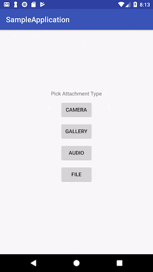
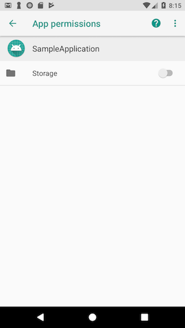

# AndroidFilePickerLibrary
 A light weight file picker library based on Android Storage Access Framework (SAF). It does not only let's you pick from internal storage, external storage but also you let's you take image/video directly from camera. There is no custom UI, you get to use the nice UI provided by Android so on newer versions new features will be automatically enabled. **Supports min SDK 16**. 
 
## Why use this library?
 
As this library uses Android Storage Access Framework (SAF) so it does not need any storage access run time permissions (READ_EXTERNAL_STORAGE, WRITE_EXTERNAL_STOARAGE). You only have to integrate it into your app and don't have to worry about any permissions. **Library returns a `Uri` back to the calling app and that Uri has persistable read and write permissions so calling app can access that file for as long as its wants without worrying about any runtime storage permission.** 
 
    

In above video and screenshot you can see that app is working fine without storage permissions enabled.

## Download
```
implementation 'io.github.informramiz:androidfilepickerlibrary:1.4'
```

## Getting Started

Using the library is as simple as writing 1 line of code. 

```
public class MainActivity extends AppCompatActivity {
   	...
   	
    @Override
    protected void onCreate(Bundle savedInstanceState) {
        ...
    }

	//call the library to pick relevant file
    @OnClick({R.id.button_camera, R.id.button_gallery, R.id.button_audio, R.id.button_file})
    public void onClick(View view) {
        switch (view.getId()) {
            case R.id.button_camera:
                FilePicker.showCameraPickerDialog(this);
                break;
            case R.id.button_gallery:
                FilePicker.openGalleryPicker(this);
                break;
            case R.id.button_audio:
                FilePicker.openAudioPicker(this);
                break;
            case R.id.button_file:
                FilePicker.openDocumentPicker(this);
                break;
        }
    }

    @Override
    protected void onActivityResult(int requestCode, int resultCode, Intent data) {
        super.onActivityResult(requestCode, resultCode, data);
        //check if this result of AndroidFilePickerLibrary
        if (FilePicker.canHandleActivityResult(requestCode)) {
            //fetch the returned object
            FileInfo fileInfo = FilePicker.onActivityResult(requestCode, resultCode, data);
            //show the UI in a TextView
            uriTextView.setText("Uri: " + fileInfo.getUri().toString());
        }
    }
}
```

The Library returns picked file/image info in the form of following object.

```
public class FileInfo implements Parcelable {
    private String name;
    //mime type of file
    private String type;
    private String extension;
    private Long size;
    private String uri;
    /**
     * This field is only set if app has storage permissions otherwise
     * it is always null so your app should not rely on this field and
     * should only use `uri` field.
     */
    @Nullable
    private String path;
}
```

## References

- [https://github.com/DroidNinja/Android-FilePicker](https://github.com/DroidNinja/Android-FilePicker)
- [https://medium.com/@andretietz/auto-initialize-your-android-library-2349daf06920](https://medium.com/@andretietz/auto-initialize-your-android-library-2349daf06920)
- [https://commonsware.com/blog/2017/06/27/fileprovider-libraries.html](https://commonsware.com/blog/2017/06/27/fileprovider-libraries.html)
